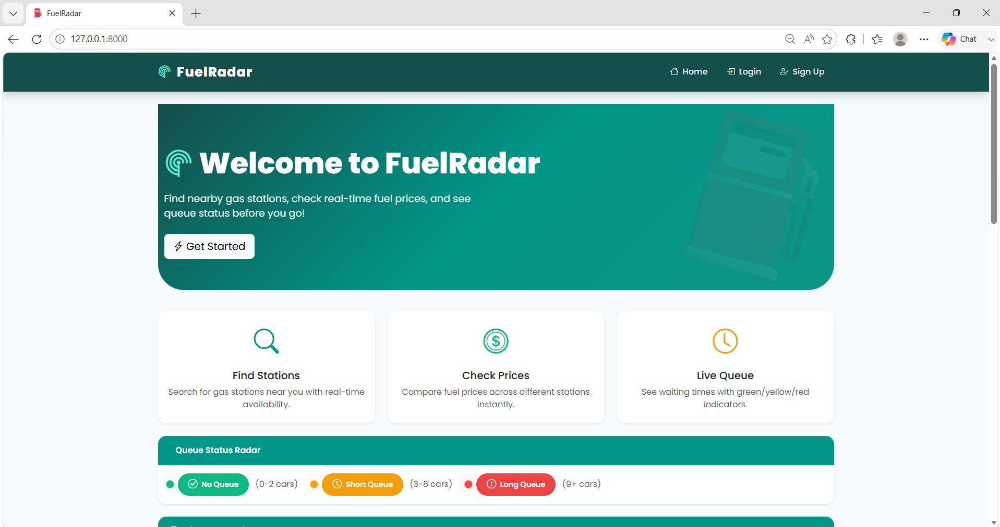
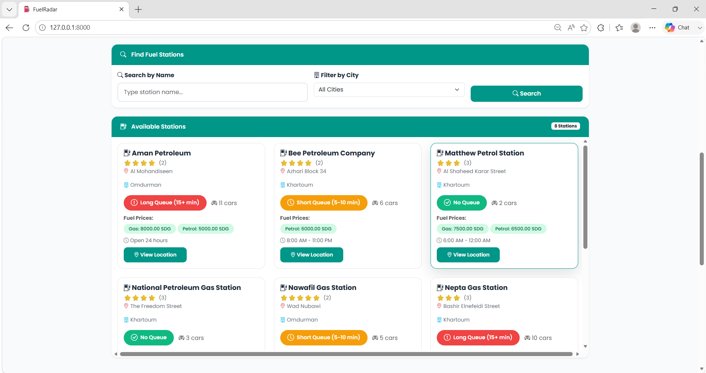
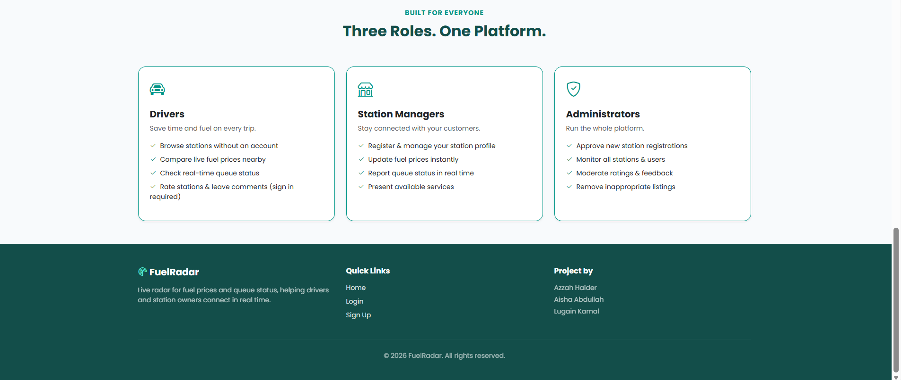
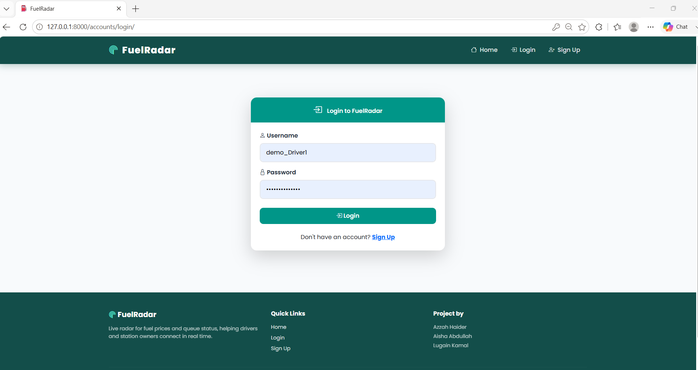
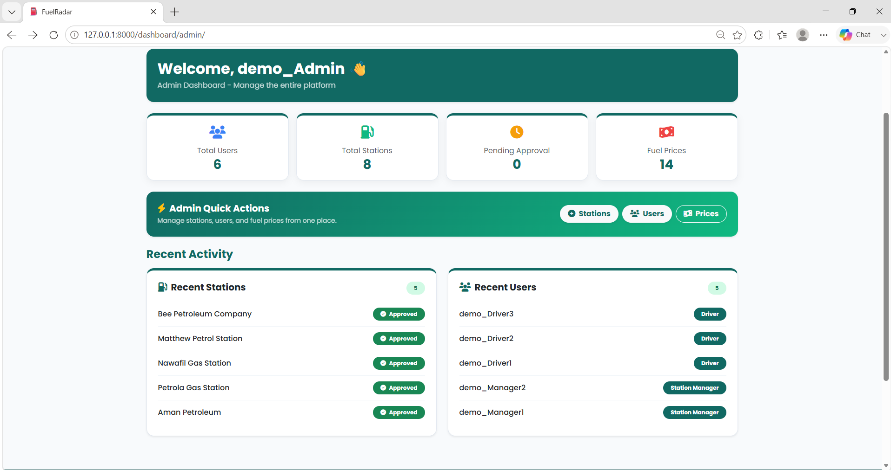
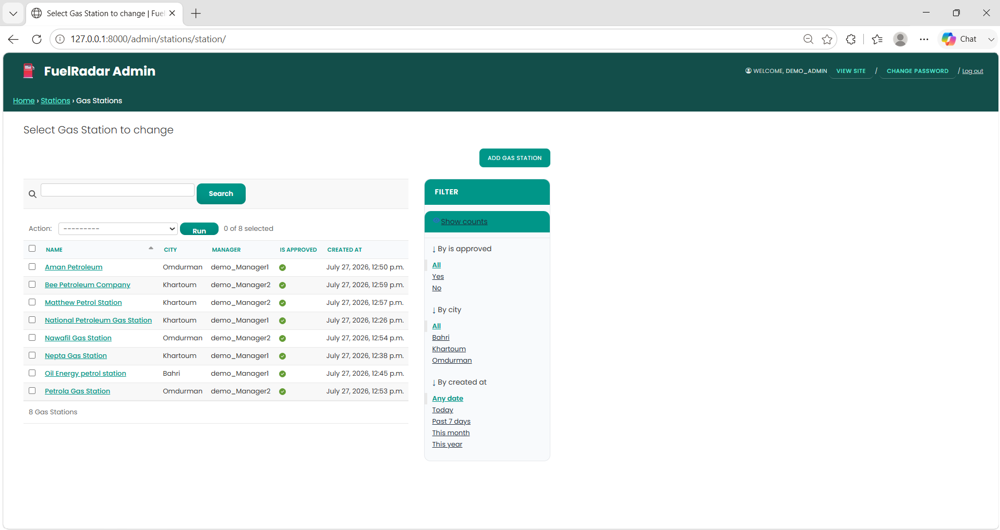
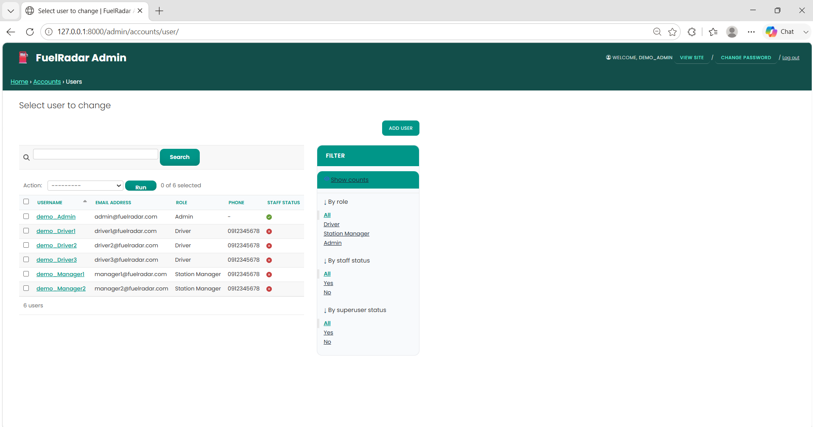
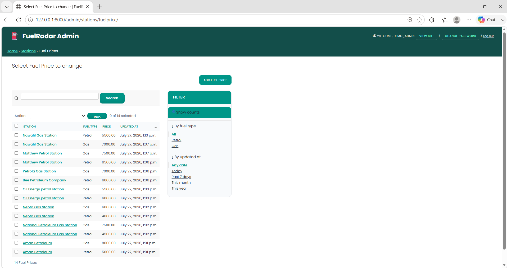
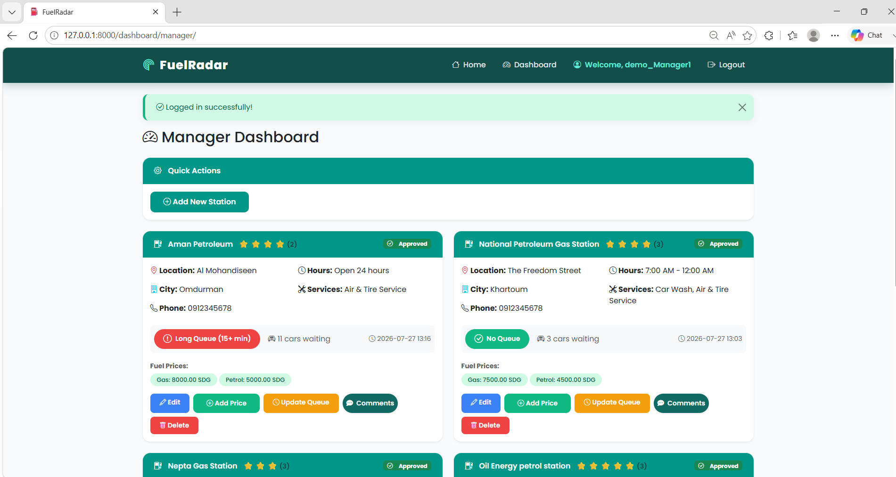
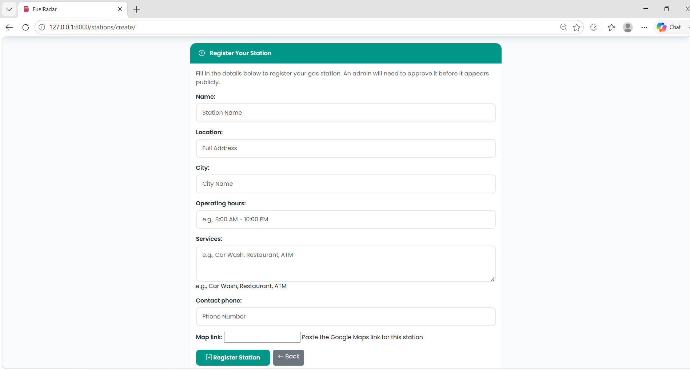

**FuelRadar**

A smart web application that helps drivers find nearby gas stations, check up-to-date fuel prices, and see real-time queue status (green / yellow / red) before they arrive.

**Team**

Azzah Haider (21-317) — CS

Aisha Abdullah (21-319) — CS

Lugain Kamal (21-320) — CS

**Problems**

Drivers waste time and fuel searching for open, affordable, low-queue gas stations.

Station owners have no easy way to broadcast live prices and traffic to customers.

FuelRadar connects the two with real-time updates.

**Who It's For?**

**Drivers** — find the cheapest nearby stations and check live wait times.

**Station Managers** — manage their station profile, update prices/queue status instantly.

**System Administrators** — approve new stations, moderate feedback, oversee the platform.

**Tech Stack**

Backend: Django (Python)

Database: SQLite

Frontend: HTML5, CSS3, Bootstrap 5

Interactivity: JavaScript, Fetch API / AJAX

Version Control: GitHub

**Core Features**

Role-based auth (Admin / Station Manager / Driver)

Full CRUD on stations, fuel status, and queue status

Live AJAX search \& filtering by city/fuel availability

Real-time station status updates without page reload

**Setup**

git clone https://github.com/Azzah-Haider/FuelRadar-.git

cd FuelRadar-

python -m venv venv

venv\\Scripts\\activate

pip install -r requirements.txt

python manage.py migrate

python manage.py runserver

**Demo Data**

A fixture with sample data (stations, fuel prices, queue statuses, and driver ratings) is included for testing and evaluation.

After running `python manage.py migrate`, load it with: **python manage.py loaddata fixtures/demo\_data.json**

**Demo accounts** (all use password: "Fuelradar@2026"):

| Username | Role |

| demo\_Admin | Admin |

| demo\_Manager1 | Station Manager |

| demo\_Manager2 | Station Manager |

| demo\_Driver1 | Driver |

| demo\_Driver2 | Driver |

| demo\_Driver3 | Driver |

**Screenshots**
**Homepage**

**Login Page**

**Admin Dashboard**

**Database Records**

**Manager Dashboard / CRUD Operations**

**User Dashboard**

